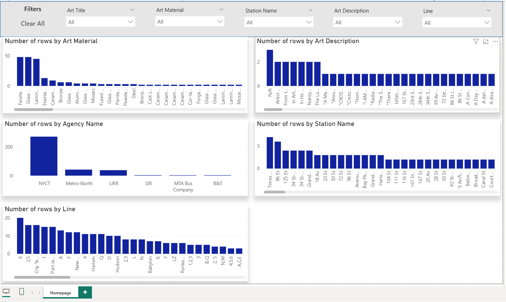
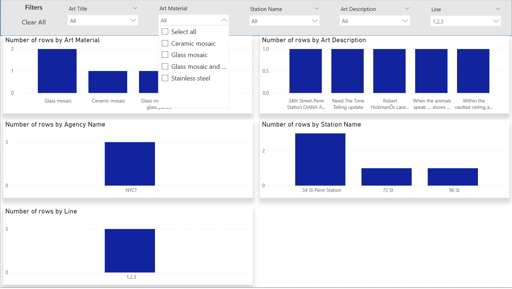

# Tidy Tuesday for July 22, 2025
### MTA Art
Sourced from: https://github.com/rfordatascience/tidytuesday/blob/main/data/2025/2025-07-22/readme.md

#### Work
At first, I tried to replicate the plots in python on a Jupyter Notebook, but the visuals quickly got ugly and very messy. I then used **Power BI** to try and replicate the [dashboard](https://data.ny.gov/stories/s/u2va-fuuf) provided by the Tidy Tuesday source. Below is my final result.

The top row uses slicers and a "Clear all slicers" to replicate the top filters from the sourced dashboard. The 5 column charts are also replicated. A challenge I was unable to solve was to create a way to swap (a) column chart(s) with a table visual like from the sourced dashboard. I was able to use a bookmark to swap the visuals for each individual chart for their respective table, but was unable to find a way to be able to swap multiple and at the same time and switch freely. I do suspect it is possible by editing the buttons, but I am still limited in my abilities. I ended up removing the buttons I created as they were clogging my visuals and because I was unable to find a permanent solution.

Below is the dashboard in use.

